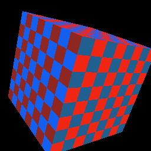

# simdpipe

**A portable SIMD software rasterizer — one WASM module, runs anywhere.**

`simdpipe` rasterizes 3D triangles to a framebuffer entirely on the CPU, using
**WebAssembly + 128-bit SIMD + threads**. It ships as a single `.wasm` and an
isomorphic ESM wrapper that runs the same in **Node and the browser**. The output
is a plain RGBA8 framebuffer in linear memory — hand it to SDL, a libretro
`video_refresh`, a `<canvas>`, or write it to a file.

It is a member of the **Mesa `-pipe` family** of software renderers
([softpipe](https://docs.mesa3d.org/drivers/softpipe.html) /
[llvmpipe](https://docs.mesa3d.org/drivers/llvmpipe.html) / lavapipe) — same
lineage, same edge-function tiled-rasterization ideas. Standing on the shoulders
of giants. Where those target maximum fidelity on native CPUs, simdpipe targets
**maximum speed in a portable sandbox** with a different bet:

> **We go fast by doing *less work*, not by going native or going wider.**
> Fixed at 128-bit SIMD by design, simdpipe wins on workloads where you can trade
> graphics fidelity for speed — retro/2D/low-poly content, and anything bottlenecked
> by GPU upload/readback/draw-call overhead — via configurable fidelity knobs
> (nearest vs bilinear, affine vs perspective-correct, depth/blend on/off, …).



*A textured cube rendered entirely on the CPU through simdpipe's pipeline:
MVP transform → SIMD rasterization → programmable fragment shader → framebuffer.*

> **Status: early but real.** The full stack works end-to-end: SIMD rasterizer,
> threads, **programmable fragment shaders** (Tier-2), a **runtime WASM shader
> JIT** (Tier-1, proven — the engine compiles generated bytes to native), a
> GL-shaped front end, and the fidelity knobs. It is **not** a conformant WebGL2
> context yet (that's the big roadmap item) — see the roadmap below for what's
> done vs. next.

## Install

```
npm install simdpipe
```

## Use

```js
import { createRenderer, FLAGS, VERTEX_STRIDE } from 'simdpipe';

const r = await createRenderer({ width: 640, height: 480 });

// Fidelity knobs — turn expensive work off to go faster.
r.setFlags(FLAGS.DEPTH_TEST | FLAGS.PERSP_CORRECT); // | FLAGS.BILINEAR | FLAGS.TEXTURE | FLAGS.BLEND

r.clear(0xff101018 /* RGBA8 little-endian: 0xAABBGGRR */, 1.0);

// Flat vertex buffer. 10 floats/vertex: x y z invw  r g b a  u v
// (screen-space x,y in pixels; z in [0,1]; invw for perspective; rgba & uv in [0,1])
const tri = new Float32Array([
  100, 100, 0.5, 1,  1, 0, 0, 1,  0, 0,
  500, 120, 0.5, 1,  0, 1, 0, 1,  1, 0,
  300, 400, 0.5, 1,  0, 0, 1, 1,  0, 1,
]);
r.drawTriangles(tri, /* ntris */ 1);

// Zero-copy RGBA8 framebuffer view over WASM linear memory:
const fb = r.getFramebuffer();            // Uint8Array, length w*h*4
// In a browser you can hand getImageData() straight to a canvas:
// ctx.putImageData(new ImageData(r.getImageData(), r.width, r.height), 0, 0);
```

### Fidelity flags

| Flag | On | Off (faster) |
|---|---|---|
| `DEPTH_TEST` | z-buffer test + write | no depth |
| `TEXTURE` | sample bound texture | use interpolated vertex color |
| `BILINEAR` | 4-tap bilinear | nearest (1 tap) |
| `PERSP_CORRECT` | perspective-correct interp | affine (PS1-style, faster) |
| `BLEND` | src-alpha over dst (reads framebuffer) | opaque write |

Bind a texture with `r.bindTexture(rgba8Pixels, w, h)` (power-of-two dimensions
for now).

### Programmable shaders + the GL-shaped API

```js
import { createGL } from 'simdpipe/lib/gl.mjs';
import { shaders } from 'simdpipe/lib/program.mjs';

const gl = await createGL({ width: 256, height: 256 });
gl.useProgram(shaders.texturedModulate(tex, tw, th)); // or .procedural(), .vertexColor(), or your own
gl.setMVP(gl.mat4.multiply(proj, modelview));
gl.clear();
gl.drawArrays(attribs, /*stride*/ 8, { pos: 0, color: 3, uv: 6 }, vertexCount);
const fb = gl.getFramebuffer();
```

A fragment shader is just a function over SoA planes — `procedural()` in
`lib/program.mjs` is a worked example. (The same plane-in/color-out contract is
what the Tier-1 WASM JIT fills.)

See `examples/browser-cube.html` for the isomorphic browser demo (serve the repo
root over HTTP and open it — the **same `.wasm`** runs in the browser, presenting
to a canvas).

## Benchmarks

Run on Node/V8 — `npm run bench`. simdpipe (WASM+SIMD) vs an idiomatic
**scalar-JS** rasterizer doing the *same* edge-function work, so the number
isolates exactly what SIMD buys. (512×512, median of 60 frames, V8 24.)

```
family                                 simd ms     js ms   speedup   simd Mpx/s
fill-rate (200 big tris, overdraw)       9.9        26.9     2.7x         ~76
balanced  (2k mid tris)                  8.6        21.8     2.6x         ~85
small-tris (20k @ 8px)                   4.4         6.9     1.6x         ~88
small-tris (50k @ 4px)                   5.0         6.4     1.3x         ~58
```

Fill-rate-bound work (the SIMD-friendly case) is ~2.7× faster than scalar JS;
tiny-triangle work is setup-bound and gains less.

### Threads (the multiplier on top of SIMD)

`npm run bench:threads` rasterizes across N disjoint framebuffer bands in
parallel (no locking — each thread owns distinct rows). Output is **bit-identical**
to the single-thread render. Scaling on a 24-core box (1024×1024, 4000 tris):

```
threads   ms     speedup
1         35.7    1.00x
2         19.2    1.87x
4         11.3    3.16x
8          8.0    4.46x
24         7.2    4.96x
```

A **persistent worker pool** (`npm run bench:pool`) goes further: created once,
with atomic tile-row dispatch (work-stealing, so uneven scenes load-balance) and
no per-frame thread spawn. On a heavy fill-bound frame it hits **5.0× over serial**
and beats the per-frame band spawn — with **bit-identical** output. (Threading
only helps on substantial frames; pooled draws fall back to serial below a small
work threshold, since WASM barrier sync isn't free on trivial frames.)

**SIMD (~2.7×) × threads (~5×) stacks to roughly an order of magnitude over scalar
JS on fill-bound work.** All numbers are machine-dependent — run them yourself.

### Fidelity ladder — "trade fidelity for speed", quantified

`npm run bench:fidelity` renders the same shade-bound scene at descending fidelity
tiers (512×512, V8):

```
tier                                        fps    vs full
full: bilinear texture + persp + depth       38     1.00x
bilinear → nearest (1 tap vs 4 taps)         66     1.99x   ← the texture-filter lever
drop texture → flat vertex color             76     2.29x
cheapest: affine vertex color               116     3.51x
```

Bilinear→nearest alone is ~2×; the full ladder ~3.5×. **That's the whole thesis:**
each knob you turn off buys speed — pick your point on the curve.

### Runtime shader JIT (Tier-1) — real GLSL, compiled to native SIMD

You author a GLSL-ish fragment shader; simdpipe parses it to an IR and **emits a
SIMD WASM kernel at runtime**, which the host engine (V8) **compiles to native
machine code** (~0.001 ms warm). The part everyone says is impossible — JIT in
WASM — done: you don't make memory executable yourself, the engine does it for you
(`lib/wasm-emit.mjs` is a tiny WASM binary encoder).

```js
const prog = gl.createJITProgram(`
  uniform float t;
  void main(){
    float w = 0.5 + 0.5*sin(uv.x*12.0 + t);
    gl_FragColor = vec4(mix(color.rgb, vec3(w, 0.0, 1.0), 0.5), 1.0);
  }`);
console.log(prog.jit); // true → native SIMD kernel (false → JS fallback, e.g. texture())
gl.useProgram(prog);
```

`npm run jit-shader` runs a JIT'd procedural shader against the JS backend (the
correctness oracle): **max channel delta 1** (rounding), and **~93× faster** than
the per-pixel JS shader (0.22 ms vs 20.6 ms @ 128²). Supported in the JIT: `uv`,
`color`, uniforms, `vecN`, swizzles, `+ - * /`, and `sin cos abs floor fract sqrt
min max clamp mix step mod`. `texture()` shaders fall back to the JS backend
(WASM has no gather). `npm run bench:jit-simd` shows the raw kernel win (2.5–3.9×
over scalar JS on ALU-heavy work).

> Honest scope: simdpipe does **not** try to beat a real GPU on raw fill rate, or
> a native AVX-512 `llvmpipe` at equal fidelity — those are physically out of reach
> for portable 128-bit WASM. It aims to beat them where it counts: lower fidelity,
> and total frame latency on overhead-bound workloads, with zero GPU/driver
> dependency.

## Roadmap

- [x] SIMD edge-function rasterizer core, z-buffer, vertex color + nearest/bilinear textures, fidelity flags, benchmarks
- [x] Threads — band-parallel + a **persistent work-stealing pool** (bit-identical, ~5× on 24 cores)
- [x] Programmable fragment shaders (Tier-2) — varying G-buffer + JS shaders
- [x] **GLSL → IR → Tier-1 WASM JIT** — author real shaders; engine compiles to native SIMD (~93× over the JS shader)
- [x] GL-shaped front end — MVP transform, vertex stage, `drawArrays`, spinning textured cube
- [x] Fidelity ladder — bilinear/nearest, perspective/affine, texture/flat (~3.5× span)
- [ ] True per-tile binning (setup once, bin to overlapped tiles) for setup-bound scenes
- [ ] JIT texture sampling (swizzled tiles; today texture() shaders use the JS backend)
- [ ] Conformant WebGL2 / GL ES 3.0 API surface
- [ ] More fidelity knobs (MSAA off + post-AA, fp16, fast-math, RGB565, …)

## How it works (one paragraph)

Triangles are rasterized with **edge functions** (Pineda): three half-space edge
equations whose values, pre-scaled by the inverse signed area, *are* the
barycentric weights — so the inside test is a bare sign check and attribute
interpolation reuses the same values. The inner loop processes **4 pixels per
`v128`** in SoA, stepping each edge incrementally (adds only, no per-pixel
multiplies). Depth, color/texture, and blend are masked per-lane. The framebuffer
is RGBA8 in linear memory for zero-copy hand-off.

## License

MIT © Luis Montes. See [LICENSE](./LICENSE).
